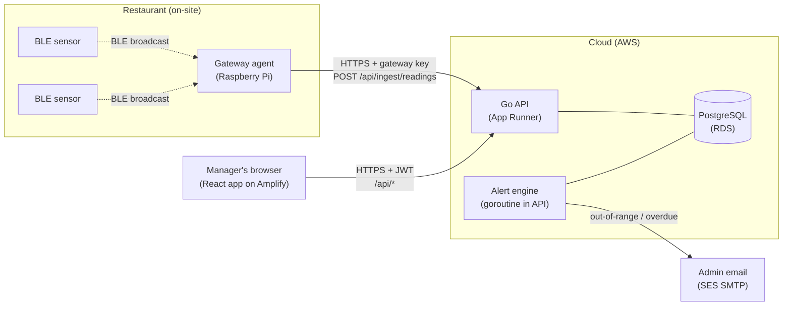
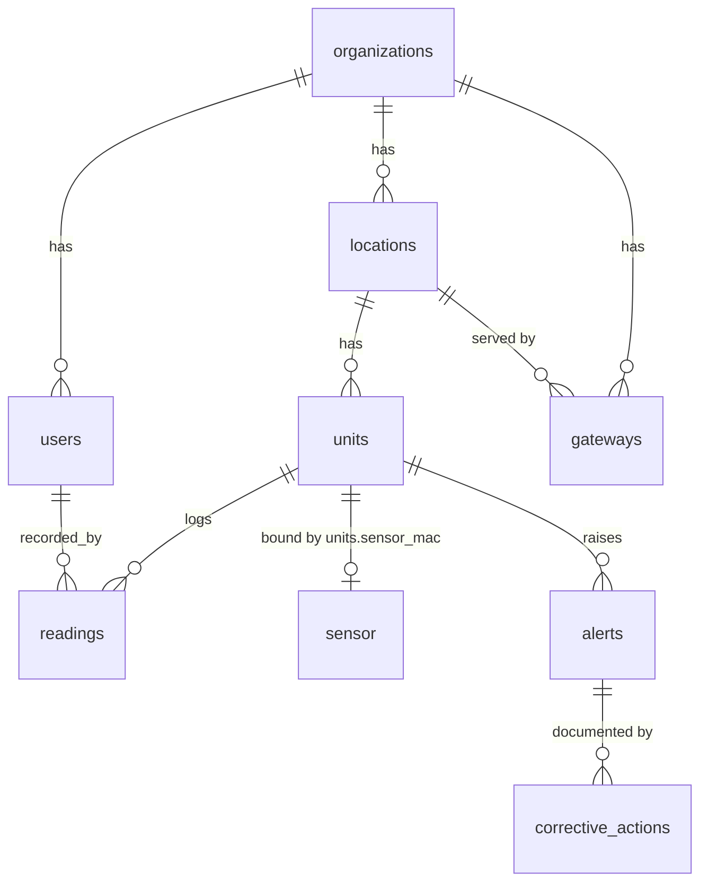

# ChillCheck — Architecture

ChillCheck is a temperature / cold-chain compliance system for restaurants. It replaces
paper temperature-log clipboards with automatic monitoring and inspection-ready PDF
reports. This document describes how the pieces fit together. For how to run it see
`README.md`; for working conventions see `CLAUDE.md`.

## 1. The three runtimes

ChillCheck is three programs plus a database:

| Component | Tech | Role |
|-----------|------|------|
| **Web app** | React + TypeScript + Vite + Tailwind + shadcn/ui + TanStack Query | Manager-facing UI: dashboard, manual logging, reports, gateway/sensor setup, alerts feed, billing, onboarding |
| **API** | Go (chi, pgx) | Stateless HTTP service that owns all database access, plus an in-process alert engine and Stripe billing |
| **Gateway agent** | Go (standard toolchain, `tinygo.org/x/bluetooth`) | Runs on-site on a Raspberry Pi / mini-PC; turns nearby BLE sensor broadcasts into API calls |
| **Database** | PostgreSQL | System of record (RDS/Aurora in production) |
| **BLE sensors** | Off-the-shelf (Xiaomi LYWSD03MMC, BTHome v2 devices) | Broadcast temperature over Bluetooth; no internet of their own |

The web app and the gateway are independent clients of the API. They authenticate
differently (see §4) and never talk to each other or to the database directly.

## 2. Runtime topology



## 3. Data flows

There are three flows worth understanding; everything else is CRUD.

### 3a. Manual logging (the Weeks 1–3 core)

Staff read a thermometer and type the value on a tablet.

```
tablet → React app → POST /api/readings (JWT) → store.CreateReading → readings (source='manual')
```

The dashboard reads `GET /api/locations/{id}/status`, which joins each unit to its latest
reading and computes a status via `store.ComputeStatus`.

### 3b. Sensor ingest (the Weeks 4–6 automation)

A BLE sensor in a fridge broadcasts its temperature every few seconds. It can't reach the
internet, so the on-site gateway is the bridge:

```
sensor --BLE--> gateway: decode → sample → (HTTPS) → POST /api/ingest/readings (gateway key)
                                                          → resolve MAC → unit
                                                          → store.CreateSensorReading
                                                          → readings (source='sensor')
```

Inside the gateway: `scan` decodes advertisements (Xiaomi ATC/pvvx on `0x181A`, BTHome v2
on `0xFCD2`) into Celsius, converts to Fahrenheit; `sampler` keeps the newest reading per
sensor and emits one batch per `sample_interval` (default 5 min); `client` POSTs the batch;
on any failure the batch goes to a disk `spool` and is retried next cycle. Each reading
carries the timestamp it was *measured*, so buffered data lands in the log at the right
time, not at delivery time. The server records readings only for MACs bound to a unit
(`units.sensor_mac`) and ignores the rest.

### 3c. Alerting

```
alert engine (ticks every ALERT_INTERVAL)
  → store.EvaluateUnits  (every unit + its latest reading)
  → store.ComputeStatus  (ok | out_of_range | overdue | no_data)
  → reconcile open alerts: open+notify on a new problem, resolve on recovery
  → email.Mailer (log by default, or SMTP email to the org's admins)
```

`ComputeStatus` is the **single source of truth** for status — the dashboard endpoint and
the alert engine both call it, so the board and the alerts can never disagree.

### 3d. Billing

One organization is one Stripe customer. Subscribing and managing payment use Stripe's
hosted pages, so card data never reaches our servers; subscription state flows back in via
a signed webhook:

```
browser → POST /api/billing/checkout → Stripe Checkout (hosted) → user pays
Stripe → POST /api/webhooks/stripe (signed) → store.UpdateOrgSubscription (by customer id)
```

Entitlement (`internal/billing/entitlement.go`) is derived from the synced status: active,
unexpired trial, or past_due all count as entitled. It gates **only expansion** (creating
new locations/units); logging, ingest, reads, and report export always work so an unpaid
account never loses or is locked out of its compliance record. When `STRIPE_SECRET_KEY` is
unset, billing is disabled and entitlement is always true. Pricing is **per location**
(subscription quantity = location count, synced on location creation), and only **admins**
can start checkout or open the portal.

## 4. Authentication (two realms)

The API serves two kinds of caller, with separate middleware:

- **Users (managers)** — `requireAuth`. Email + password (bcrypt), HS256 **JWT** bearer
  token, 30-day expiry. Claims carry `(user_id, org_id)`. Designed so the whole app depends
  only on `(UserID, OrgID)` from request context — swapping in Amazon Cognito later is
  contained to `internal/auth` + that middleware.
- **Gateways (devices)** — `requireGateway`. A long random **gateway key** sent as
  `X-Gateway-Key`. Only its SHA-256 hash is stored, looked up per request (fast, not bcrypt;
  the key has enough entropy). Resolves to `(org_id, location_id)`. The plaintext key is
  returned exactly once, at creation.

Every store query is scoped by `org_id`; a caller can only ever see or write its own
organization's data. Cross-tenant access is structurally impossible, not policed per-handler.

Two short-lived **link tokens** round this out: team invites and password resets. Both are
random tokens shown only in the link; the database stores just a sha256 hash, with an expiry
(invites 7 days, resets 1 hour, single-use). Accepting an invite mints a normal user JWT.

## 5. Data model



- **organizations** — the paying account (tenant root). Also holds Stripe billing state:
  `stripe_customer_id`, `stripe_subscription_id`, `plan`, `subscription_status`,
  `trial_end`, `current_period_end`.
- **users** — `admin` | `staff`, belong to an org. Admins receive alert email.
- **locations** — a physical restaurant/kitchen; an org may have several.
- **units** — a monitored fridge / freezer / hot-hold, with a safe `min/max_temp_f` and a
  `log_interval_minutes`. `sensor_mac` (nullable) binds one BLE sensor to the unit.
- **readings** — time series; `source` is `manual` or `sensor`; `temp_f` Fahrenheit;
  `recorded_at` is the measurement time; `recorded_by` is null for sensor readings. Each row
  also carries hash-chain fields (`chain_seq`, `prev_hash`, `row_hash`) making the log
  **tamper-evident**: every reading hashes its own fields plus the previous row's hash, so an
  edit or deletion made directly in the database breaks the chain (see `VerifyReadingChain`).
- **gateways** — an on-site agent's identity; stores `api_key_hash` + `key_prefix` +
  `last_seen_at`.
- **alerts** — `out_of_range` | `overdue`, `open` | `resolved`. A partial unique index
  `(unit_id, kind) WHERE status='open'` enforces one open alert per problem, so a sustained
  fault notifies once.
- **corrective_actions** — HACCP documentation attached to an alert: `action`,
  `disposition` (product outcome), `note`, `recorded_by`. Surfaced in the compliance PDF.
- **invites** — pending team invitations (`email`, `role`, `token_hash`, `expires_at`,
  `accepted_at`); cleared by acceptance or revocation.
- **password_resets** — single-use reset tokens (`user_id`, `token_hash`, `expires_at`,
  `used_at`).

Temperatures are stored in **Fahrenheit** throughout. Sensors report Celsius; conversion
happens once, at the gateway edge.

## 6. Inside the API

```
backend/internal/
  config/   env config (DB, JWT secret, CORS, alert/SMTP, Stripe settings)
  auth/     bcrypt + JWT (user); gateway key + invite/reset tokens (sha256)
  store/    pgx pool, models, all org-scoped SQL, ComputeStatus, reading hash chain
  email/    Mailer interface (LogMailer / SMTPMailer) — alerts, invites, resets
  api/      chi router, requireAuth + requireGateway middleware,
            handlers (auth, locations, units, readings, status, gateways,
            ingest, alerts, corrective actions, integrity, billing + Stripe webhook,
            team invites, password reset),
            compliance PDF (go-pdf/fpdf)
  alerts/   engine (goroutine), sends via email.Mailer
  billing/  Stripe client (Checkout / Portal / webhook) + entitlement
```

The API process is stateless except for the alert-engine goroutine. It is started from
`cmd/api/main.go`; there is also `cmd/seed` for demo data.

## 7. Inside the gateway

```
gateway/  (separate Go module; standard toolchain, NOT TinyGo)
  internal/ble/      decode.go (Decoder interface + Xiaomi, BTHome) ; scan.go (BLE + simulator)
  internal/sampler/  newest-per-MAC, one batch per interval
  internal/spool/    disk-backed JSON-lines store-and-forward (bounded)
  internal/client/   HTTPS client for /api/ingest/readings
  internal/config/   YAML + env
  internal/reading/  shared Reading type
  main.go            wiring, run loop, signal handling
```

`tinygo.org/x/bluetooth` is the "Go Bluetooth" library; on Linux it uses BlueZ over D-Bus in
pure Go and compiles with the standard Go toolchain (`CGO_ENABLED=0` cross-compile to the
Pi). A simulator source emits fake sensors so the whole pipeline runs with no hardware.

## 8. Deployment

| Piece | Production (AWS) | Local dev |
|-------|------------------|-----------|
| Frontend | Amplify Hosting (static build) | `vite dev` on :5173 |
| API | App Runner (container, `backend/Dockerfile`) | `go run ./cmd/api` on :8080 |
| Database | RDS / Aurora Postgres | `docker compose up` Postgres |
| Gateway | on-site Pi, systemd unit | `go run . --simulate` |
| Alert email | SES SMTP | logged (no `SMTP_HOST`) |
| Billing | Stripe live keys + webhook endpoint | Stripe test mode + `stripe listen` (or disabled) |

**App Runner, not Lambda**, for the API — a long-lived process avoids the Lambda + Postgres
connection-exhaustion trap and keeps the alert-engine goroutine simple.

## 9. Key decisions (and why)

- **JWT + bcrypt instead of Cognito (for now)** — runs with zero AWS setup so a restaurant
  can be demoed this week; the swap is contained.
- **Fahrenheit storage** — US inspectors work in °F; storing the value verbatim avoids
  conversion error in a compliance record.
- **`units`, not `sensors`** — a unit is logged manually now and gets a BLE sensor bound
  later without a schema change.
- **Gateway store-and-forward** — an internet outage must not leave a gap; gaps fail audits.
- **Standard Go for the gateway, not TinyGo** — it's an OS-class device using `net/http` and
  a filesystem spool; TinyGo is only for bare-metal microcontrollers.
- **Alert engine in-process** — simplest thing that works for a single App Runner instance.
- **`ComputeStatus` shared** — one definition of "out of range / overdue" for both the board
  and alerts.
- **Hosted Stripe Checkout + Portal, webhook-synced** — no card data on our servers;
  subscription status is only ever trusted from a signed webhook, and billing gates only
  expansion so an unpaid account never loses compliance data.

## 10. Known limits / what to revisit

- **Alert engine is replica-safe** via a Postgres advisory lock (`store.WithLeaderLock`):
  only the lock holder evaluates a given tick, so alerts aren't sent N times when the API
  runs multiple App Runner instances. For very large fleets a dedicated worker is still the
  cleaner long-term split.
- **`readings` growth** — fine on plain Postgres at pilot scale; consider partitioning or
  TimescaleDB when the table gets large.
- **Auth token lives in `localStorage`** (Bearer JWT). The current defense is a strict
  build-time CSP (`frontend/vite.config.ts`) plus `securityHeaders` on the API, which blocks
  the XSS vector a stored token is exposed to. This is the proportionate fix while the
  frontend (Amplify) and API (App Runner) sit on **different domains** — an httpOnly cookie
  there would need `SameSite=None` and a CSRF token. **Revisit when both move to a shared
  parent domain** (e.g. `app.` + `api.chillcheck.app`): switch to an httpOnly, `Secure`,
  `SameSite=Lax` cookie set by the API. The change is contained — `requireAuth` reads the
  cookie instead of the `Authorization` header, login/register/accept/reset set it, add a
  logout route to clear it, set CORS `AllowCredentials`, and drop the token plumbing from
  `frontend/src/lib/api.ts` + `AuthContext`. SameSite then covers CSRF, and the compliance
  PDF can open as a plain link instead of a header-carrying blob fetch.
- **Health-code thresholds vary** by state/local authority; the default safe ranges are
  starting points, set per unit by operators — not legal guidance.
- **Next:** usage analytics, native mobile.
